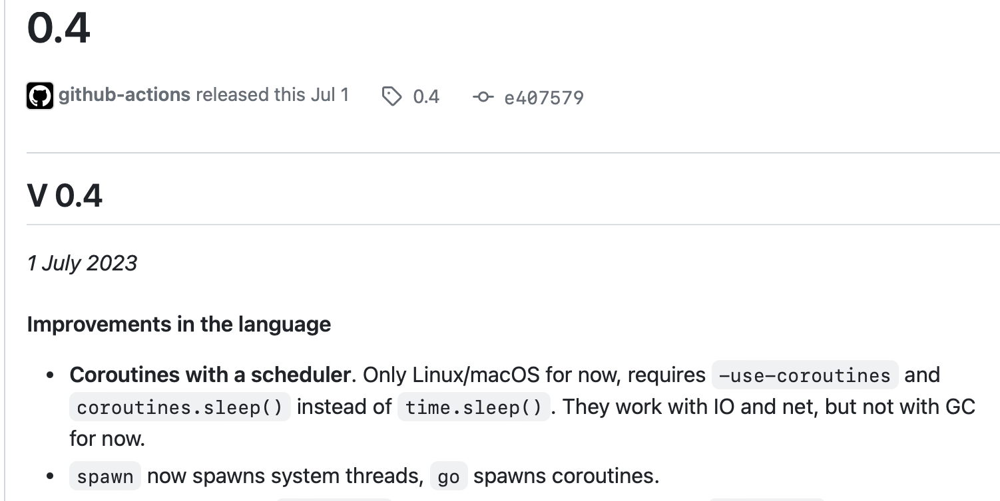

So you've found a new programming language called V. It looks nice, has a lot of promises on the website, nice syntax, but how does it really work?

Everything described here is correct for the [`b66447cf11318d5499bd2d797b97b0b3d98c3063`](https://github.com/vlang/v/commit/b66447cf11318d5499bd2d797b97b0b3d98c3063) commit. This is a summary of my experience with the language over 6 months + information that I found on Discord while I was writing this article.

The article is quite long, because I tried to describe everything in as much detail as possible and anyone could reproduce the same behavior.

Where do you start learning a new programming language? That's right, from the documentation. V documentation is one huge  [`docs.md`](https://github.com/vlang/v/blob/master/doc/docs.md) file.

Not far from the beginning, you can notice the built-in types that V has. The small `soon` prefix for types `i128` and `u128` describes the state of the entire language. This note has been in the documentation for at least 4 years ([`commit`](https://github.com/vlang/v/commit/65a8db85254b8d8d02098843202142e61aa02570)), apparently we need to wait a little longer.


Next, you may notice that, unlike C and Go, `int` is always 32 bit. But, in release [0.4.3](https://github.com/vlang/v/releases/tag/0.4.3) it is now 64 bit on 64-bit systems and 32 bit on 32-bit systems.

A couple of errors, you say, but no, this is the whole of V documentation. There are so few developers to keep the documentation in the correct state. Documentation often does not describe the most important parts of the language — for example, the [section](https://github.com/vlang/v/blob/master/doc/docs.md#generics) about generics consists of a couple of code examples without proper description.

Promises as the following are also common in documentation:

> Currently, generic function definitions must declare their type parameters, but in the future V will infer generic type parameters from single-letter type names in runtime parameter types.

And now you scroll down to the most interesting thing, memory management in V. In modern programming languages, this is almost the most important part of the language. What does V offer? First of all, this is "Garbage Collection", a good option that greatly simplifies life, the second option "arena", also a great option, "manual memory management" is also available for experienced programmers. The last and most interesting option is "autofree".

The first two options work relatively well, so let's look at the last two.

### Manual memory management

In this mode, libc's malloc function is used for all allocations and the developer must clean up the memory himself. But what about the memory allocated inside standard library functions? Let's take a look at the `is_ascii` [method](https://github.com/vlang/v/blob/cc220e60a5a0cc787b68ae357c8ecfd2dc561b6f/vlib/builtin/string.v#L2379C2-L2379C2):

```v
@[inline]
pub fn (s string) is_ascii() bool {
    return !s.bytes().any(it < u8(` `) || it > u8(`~`))
}
```

It might seem like a small safe function, but if you call it with manual memory management, you will have leaks, since no one clears the memory allocated by the `bytes()` [method](https://github.com/vlang/v/blob/cc220e60a5a0cc787b68ae357c8ecfd2dc561b6f/vlib/builtin/string.v#L2040). Here are [more](https://github.com/vlang/v/blob/master/vlib/builtin/string.v#L822) [such](https://github.com/vlang/v/blob/cc220e60a5a0cc787b68ae357c8ecfd2dc561b6f/vlib/builtin/string.v#L901) [examples](https://github.com/vlang/v/blob/master/vlib/builtin/string.v#L338). And this is only in string methods; in the standard library it is everywhere.

Well, you can just not use these functions in your code. Let's see what if you want a web server on V in "manual" mode. V has a built-in framework called `vweb`. The official examples include the following code: https://github.com/vlang/v/blob/master/examples/vweb/vweb_example.v.

I've simplified it as much as possible:

```v
module main

import vweb

struct App {
    vweb.Context
}

pub fn (mut app App) index() vweb.Result {
    return app.text("Hello World")
}

fn main() {
    vweb.run(&App{}, 8082)
}
```

[Next](https://github.com/vlang/v/blob/master/vlib/vweb/vweb.v#L571) [arrays](https://github.com/vlang/v/blob/cc220e60a5a0cc787b68ae357c8ecfd2dc561b6f/vlib/vweb/vweb.v#L542) [never](https://github.com/vlang/v/blob/master/vlib/vweb/vweb.v#L572) [deallocated](https://github.com/vlang/v/blob/cc220e60a5a0cc787b68ae357c8ecfd2dc561b6f/vlib/vweb/vweb.v#L958) in [vweb](https://github.com/vlang/v/blob/cc220e60a5a0cc787b68ae357c8ecfd2dc561b6f/vlib/vweb/vweb.v#L729) code. This means that your application on vweb will have leaks.

Well, not everyone writes web, maybe you need a simple CLI utility? Unfortunately, all string interpolations in the standard library for the CLI allocate memory then not cleaned up.

From all of the above, I can draw the following conclusion: manual memory management in V is a feature that cannot be used in real applications. At most in simple programs where you write everything from scratch or memory leaks are not critical for you.

### autofree

Now we come to the most interesting thing in this section. Let's see how this mode is described in the documentation:

> The second way is autofree, it can be enabled with `-autofree`. It takes care of most objects (~90-100%): the compiler inserts necessary free calls automatically during compilation. Remaining small percentage of objects is freed via GC. The developer doesn't need to change anything in their code. "It just works", like in Python, Go, or Java, except there's no heavy GC tracing everything or expensive RC for each object.

Surprisingly, they were able to lie in every sentence. Let's start from the very beginning, the documentation assures us that 90–100% will be cleaned up automatically using `free` calls inserted by the compiler. This sounds pretty optimistic, considering that to achieve the same thing in Rust, you need a lot of help to the compiler. The V compiler turns out to be "much smarter" than the Rust compiler. 

While I was looking at [discussions](https://github.com/vlang/v/discussions?discussions_q=is%3Aopen+autofree&page=1) in the language repository, I came across a interesting comment ([link](https://github.com/vlang/v/discussions/12343#discussioncomment-5828322)):

> In my v program, only 0.1% was autofreed and 99.9% was freed by the garbage collector. It all depends on the program you are making. The GC is still really fast though.

But, let’s not take this as a fact and try it ourselves. Here’s the simplest code:

```v
module main

struct Data {
    data []bool
}

fn main() {
    p := Data{
        data: [true, false]
    }
    println(p.data)
}
```

Compile it using `v -autofree main.v`. And run `valgrind`:

```
=653065= Memcheck, a memory error detector
=653065= Copyright (C) 2002-2017, and GNU GPL'd, by Julian Seward et al.
=653065= Using Valgrind-3.18.1 and LibVEX; rerun with -h for copyright info 
=653065= Command: /test
=653065=
[true, false]
=653065=
=653065= HEAP SUMMARY:
=653065=   in use at exit: 2 bytes in 1 blocks
=653065= total heap usage: 6 allocs, 5 frees, 1,085 bytes allocated
=653065=
=653065= LEAK SUMMARY:
=653065=    definitely lost: 2 bytes in 1 blocks
=653065=    indirectly lost: 0 bytes in 0 blocks
=653065=      possibly lost: 0 brtes in 0 blocks
=653065=    still reachable: 0 bytes in 0 blocks
=653065=         suppressed: 0 bytes in 0 blocks
=653065= Rerun with --leak-check=full to see details of leaked memory
=653065=
=653065= ERROR SUMMARY: 0 errors from 0 contexts (suppressed: 0 from 0)
```

Something went wrong. What’s also interesting is that we have a single array in the program, but valgrind shows that a 1kb of memory was allocated. Keep this point in mind as we move on to the website's statement that V avoids unnecessary allocations.

Let's compile a simple example with a vweb server:

```v
module main

import vweb

struct App {
    vweb.Context
}

pub fn (mut app App) index() vweb.Result {
    return app.text("Hello World")
}

fn main() {
    vweb.run(&App{}, 8082)
}
```

```
v -autofree server.v
```

And let's run it with valgrind. I didn't make requests to server, but just waited 10 seconds:

```
=653318= Command: /server
=653318=
[Vweb] Running app on http://localhost:8082/
[Vweb] We have 1 workers
=653318=
=653318= Process terminating with default action of signal 2 (SIGINT)
=653318=   at 0x498882D: select (select.c:69)
=653318=   by 0×58AAF2: net__select (in /home/skvortsov/server)
=653318=   by 0x642D81: net__select_deadline (in /home/skvortsov/server)
=653318=   by 0×58B122: net__wait_for_common (in /home/skvortsov/server)
=653318=   by 0x58B40B: net__wait_for_read (in /home/skvortsov/server)
=653318=   by 0x591D43: net__TepListener_wait_for_accept (in /home/skvortsov/server)
=653318=   by 0x5915F9: net__TepListener_accept_only (in /home/skvortsov/server)
=653318=   by 0x5E57E1: vweb__run_at_T_main_App (in /home/skvortsov/server)
=653318=   by 0x5E4262: vweb__run_T_main__App (in /home/skvortsov/server)
=653318=   by 0x5F0102: main__main (in /home/skvortsov/server)
=653318=   by 0x63F220: main (in /home/skvortsov/server)
=653318=
=653318= HEAP SUMMARY:
=653318=    in use at exit: 122,833 bytes in 2,395 blocks
=653318=   total heap usage: 2,659 allocs, 264 frees, 541,413 bytes allocated
=653318=
=653318= LEAK SUMMARY:
=653318=    definitely lost: 1,004 bytes in 32 blocks
=653318=    indirectly lost: 106 bytes in 15 blocks
=653318=      possibly lost: 272 bytes in 1 blocks
=653318=    still reachable: 121,451 bytes in 2,347 blocks
=653318=         suppressed: 0 bytes in 0 blocks
=653318- Rerun with --leak-check=full to see details of leaked memory
=653318=
=653318= For lists of detected and suppressed errors, rerun with: -s 
=653318= ERROR SUMMARY: 0 errors from 0 contexts (suppressed: 0 from 0)
```

Without requests, in 10 seconds we definitely lost 1kb of memory.

Let's return to the description from the documentation:

> Remaining small percentage of objects is freed via GC.

And again it’s not true. I found a recent [commit](https://github.com/vlang/v/commit/207203f5998e6b1844a32fe628e0eb64325db64d) in which passing the `-autofree` flag immediately sets `gc` to `none`:

```diff
'-autofree' {
  res.autofree = true
+ res.gc_mode = .no_gc
  res.build_options << arg
}
```

So, the statement is completely false.

Do you know why this change was made? Let's look at an example:

```v
fn main() {
    ptr := malloc(1)
    free(ptr)
}
```

And let's look at the [definition](https://github.com/vlang/v/blob/cc220e60a5a0cc787b68ae357c8ecfd2dc561b6f/vlib/builtin/builtin.c.v#L586) of the `free` function:

```v
@[unsafe]
pub fn free(ptr voidptr) {
    $if prealloc {
        return
    } $else $if gcboehm ? {
        // It is generally better to leave it to Boehm's gc to free things.
        // Calling C.GC_FREE(ptr) was tried initially, but does not work
        // well with programs that do manual management themselves.
        //
        // The exception is doing leak detection for manual memory management:
        $if gcboehm_leak ? {
            unsafe { C.GC_FREE(ptr) }
        }
    } $else {
        C.free(ptr)
    }
}
```

[`$if`](https://github.com/vlang/v/blob/master/doc/docs.md#if-condition) specifies a condition evaluated during compilation. Previously, when we passed only `-autofree` and did not explicitly pass `-gc none`, then the condition `$if gcboehm ?` was true and since `gcboehm_leak` is also not set by default, then `free` ended up becoming a noop function that did nothing.

Here is the C code that was generated:

```c
void _v_free(voidptr ptr) {
    #if defined(_VPREALLOC)
    {
    }
    #elif defined(_VGCBOEHM)
    {
    }
    #else
    {
    }
    #endif
}
```

All of this code is C preprocessor, so the compiler sees this code as follows:

```c
void _v_free(voidptr ptr) {
}
```

And that doesn't free anything.

Let's go back to the documentation:

> Remaining small percentage of objects is freed via GC.

And this was not true, even if V inserted `free` somewhere, they had no effect and everything was cleared by the GC. Even after this fix, this is not true because the GC is disabled when the `-autofree` flag is passed.


You may have seen this video: https://www.youtube.com/watch?v=gmB8ea8uLsM

In it, the author of the language shows his editor [Ved](https://github.com/vlang/ved) and shows how he compiles it using `v . -autofree` and states that its technology is sufficiently developed that such a complex application as a text editor does not leak.

I tried to build the editor with the latest version of V with the `autofree` flag and got the following error when I launched the binary:

```
V panic: as cast: cannot cast `map[string]toml.ast.Value` to `[]toml.ast.Value`
v hash: 0966fd3
/tmp/v_1000/ved.5480247081914024169.tmp.c:13797: at _v_panic: Backtrace
/tmp/v_1000/ved.5480247081914024169.tmp.c:14296: by __as_cast
/tmp/v_1000/ved.5480247081914024169.tmp.c:43867: by toml__Doc_value_
/tmp/v_1000/ved.5480247081914024169.tmp.c:43836: by toml__Doc_value
/tmp/v_1000/ved.5480247081914024169.tmp.c:44579: by main__Config_init_colors
/tmp/v_1000/ved.5480247081914024169.tmp.c:44551: by main__Config_reload_config
/tmp/v_1000/ved.5480247081914024169.tmp.c:46595: by main__main
/tmp/v_1000/ved.5480247081914024169.tmp.c:50668: by main
```

Without `autofree` everything worked without problems. Well, apparently autofree has only gotten worse in 3 years.

Interestingly enough, the project of the language author does not work with the main feature of his language. 

Let's try to build the compiler itself with `autofree`:

```
v self -autofree -o v2
```

And let’s try to compile itself again with the resulting binary:

```
./v2 self
```

And we get an error at runtime:

```
./v2 self
/tmp/v_1000/v2.10486918756004741764.tmp.c:25123: at string_starts_with: RUNTIME ERROR: invalid memory access
/tmp/v_1000/v2.10486918756004741764.tmp.c:35912: by os__impl_walk_ext
/tmp/v_1000/v2.10486918756004741764.tmp.c:35888: by os__walk_ext
/tmp/v_1000/v2.10486918756004741764.tmp.c:42645: by v__pref__detect_musl
/tmp/v_1000/v2.10486918756004741764.tmp.c:42743: by v__pref__parse_args_and_show_errors
/tmp/v_1000/v2.10486918756004741764.tmp.c:4811: by main__main
/tmp/v_1000/v2.10486918756004741764.tmp.c:5835: by main
```

Let's go back to the last part of the documentation:

> The developer doesn't need to change anything in their code. "It just works", like in Python, Go, or Java, except there's no heavy GC tracing everything or expensive RC for each object.

What we found out above, before commit [207203f](https://github.com/vlang/v/commit/207203f5998e6b1844a32fe628e0eb64325db64d) when passing the `-autofree` flag we **got** "heavy GC tracing everything", and after we **get** memory leaks even in the simplest examples.

I would also like to note that the author of the language promised to make this technology “production ready” back to version `0.3` ([commit](https://github.com/vlang/v/blob/0f9537ece544b7fda31cadf4dc95fd4b552f94be/ROADMAP.md)), then to [0.5](https://discord.com/channels/592103645835821068/592106336838352923/1136589637658345563). and maybe in [0.6](https://discord.com/channels/273534239310479360/818964227783262209/1146427952083513467), and in [ROADMAP](https://github.com/vlang/v/blob/master/ROADMAP.md ) in 1.0.

> "Fake it ~~till you make it~~".

It’s interesting that the author of the language does not [see the point](https://discord.com/channels/592103645835821068/592106336838352923/1126201270902997114) in using `autofree` with GC, although the documentation says that it is GC that clears the remaining "10%" of objects. Marvelous.


Thus, from all of the above, we can conclude that `autofree` is a very crude technology. The author of the language tried to promote it through that video, and judging by the comments he succeeded, I don’t understand why people believe him, because a simple test shows that even simple programs leak as hell. 

**After 5 years, the most interesting feature of V is still in a very early state, and the author does nothing but promise that everything will happen soon.**

It is already clear that the author of the language and his loyal followers will begin to say that `autofree` is not yet production ready, but the problems that I described above even for the very first alpha version are unacceptable.

### GC (default)

In this section, I want to discuss the remaining shortcomings of V in the memory management system.

Let's go back to the documentation:

> V avoids doing unnecessary allocations in the first place by using value types, string buffers, promoting a simple abstraction-free code style.

It is stated that V does not make unnecessary allocations. Let's check it out. In V, if you convert a structure into an interface, you get memory allocation with no options to avoid it, so you will get a bunch of extra allocations for nothing:

```v
interface IFoo {
    name string
}

struct Foo {
    name string
}

fn get_ifoo() IFoo {
    return Foo{name: 'foo'}
}

fn main() {
    foo := get_ifoo()
    println(foo.name)
}
```

C code:

```c
VV_LOCAL_SYMBOL main__IFoo main__get_ifoo(void) {
    main__IFoo _t1 = I_main__Foo_to_Interface_main__IFoo(((main__Foo*)memdup(&(main__Foo){.name = _SLIT("foo"),}, sizeof(main__Foo))));
    return _t1;
}
```

`memdup` sends memory to heap via `_v_malloc`. In this small piece of code, you can also notice another feature of V, "readable" generated C code.

There is no escape analysis in V, and any pointers you create in a function make unnecessary allocations to the heap:

```v
fn main() {
    a := 100
    b := &a
    println(b)
}
```

In C code:

```c
void main__main(void) {
    int *a = HEAP(int, (100)); // heap allocation
    int* b = &(*(a));
    string _t1 = str_intp(1, _MOV((StrIntpData[]){{_SLIT("&"), 0xfe10 ,{.d_s = isnil(b) ? _SLIT("nil") : int_str(*b)}}})); println(_t1); string_free(&_t1);
    ;
}
```

The documentation says:

> Due to performance considerations V tries to put objects on the stack if possible but allocates them on the heap when obviously necessary.

V does not allocate to the heap **only those objects whose address is not taken** in the entire function, V doesn't do escape analysis and considers any taking of an address as a leak (in terms of "Escape Analysis") from the function. And this doesn't match the statement "Due to performance considerations V tries to put objects on the stack if possible" because any address taking results in an allocation on the heap even if it could have been avoided.

In the example above you can say that everything is correct, `b` leaks into the `println` function, so let's look at an example without the call:

```v
fn main() {
    a := 100
    b := &a
}
```

C code:

```c
void main__main(void) {
    int *a = HEAP(int, (100));
    int* b = &(*(a));
}
```

And still allocated on heap.

Instead of doing a smart escape analysis in V has a hack through the special `heap` attribute:

> A solution to this dilemma is the `[heap]` [attribute](https://github.com/vlang/v/blob/master/doc/docs.md#attributes) at the declaration of `struct MyStruct`. It instructs the compiler to *always* allocate `MyStruct`-objects on the heap.

This is a bad solution because the developer cannot control where the object is allocated in each instantiation; by marking the structure with this attribute, you automatically get unnecessary allocations that could have been avoided.

---

The quote from the beginning of the section also mentioned string buffers, so let's take a look:

```v
import strings

fn main() {
    before := gc_heap_usage()
    mut sb := strings.new_builder(1)
    sb.write_string("hello")
    res := sb.str()
    after := gc_heap_usage()
    println(res)
    println(after.bytes_since_gc - before.bytes_since_gc)
}
```

```text
hello
48
```

Allocates 48 bytes, although there are only 5 bytes in the string.

Perhaps things are better with string interpolation?

```v
fn main() {
    before := gc_heap_usage()
    world := "world"
    res := "hello ${world}"
    after := gc_heap_usage()
    println(res)
    println(after.bytes_since_gc - before.bytes_since_gc)
}
```

```text
hello world
304
```

Oho-ho, allocates 304 bytes for string of 11 characters. Impressive.

Let's talk a little more about `arena` in this section.

### Arena (`-prealloc`)

What does the documentation tell us about this mode? The only mention in the documentation I found was this line:

> Arena allocation is available via v `-prealloc`.

Oops. As I said, the documentation in V is bad.

Let me tell you myself, an arena is a way of working with memory, when at the start of the program a large chunk of memory is allocated at once, for example, 16 megabytes. Then, all allocations occur in this chunk; all explicit memory free does nothing. When a chunk is full, a new one is allocated, and so on. Before the program ends, all memory is freed.

This method is usually best suited for short-lived programs, such as compilers, where memory consumption may be less preferable to faster runtime.

What is the advantage of this mode? If small objects are often allocated in a program, then their allocation will take literally several arithmetic operations, instead of access to the operating system for memory each time.

Let's dive into the world of V. All the implementation code can be found in the [`prealloc.c.v`](https://github.com/vlang/v/blob/master/vlib/builtin/prealloc.c.v) file.

The first thing we see is the `@[has_globals]` attribute of the module. But wait a minute:

> By default V does not allow global variables. However, in low level applications they have their place so their usage can be enabled with the compiler flag `-enable-globals`.

But ok.

Below we see exactly the reason for the presence of this flag:

```
__global g_memory_block &VMemoryBlock
```

Global variable. `__global`.

But since it's global, what about multithreading? I didn’t see any mutexes, which means that `-prealloc` cannot be used in multithreaded programs safely. Is this written somewhere in the documentation? Nope. There is a comment in the file itself where this is written, apparently the author of the language believes that all users should first read the source code of the compiler.

### Conclusions about memory management

Some parts are raw, some are unsafe, some don’t work, some don't work as described. This is just what I could find. If such sloppiness is everywhere, this may mean that it is quite possible that there are even more critical bugs that we simply are not aware of.

This is where we'll finish talking about working with memory in V.

Next, let’s quickly go through the site before a new interesting topic, coroutines in V.

## Site claims

Site is stated that there are no `null` in the language, without taking into account `unsafe` code. So:

```v
struct Foo {
    data &string
}

fn main() {
    println(Foo{
        data: 0
    })
}
```

there is no `null`, but you can assign 0 to a pointer. ¯\_(ツ)_/¯


Then the site tells us that there is no UB in the language. Let's open the [article](https://en.wikipedia.org/wiki/Undefined_behavior) about UB on the wiki.

Overflows in V really haven't been UB since [recently](https://github.com/vlang/v/commit/c6412597abe24cdf099c9031ebdc47a3a263d141). It took 4 years from the release of the language to fix this UB. Although there is not a word about this in the documentation, the language also has no specification, so for the user this fact is hidden behind the compiler code. Here is a description of the С flag that was added as a fix:

> This option instructs the compiler to assume that signed arithmetic overflow of addition, subtraction and multiplication wraps around using twos-complement representation. This flag enables some optimizations and disables others.

Honestly, in a safe language, as the site says, I would expect the ability to perform these operations safely with the ability to specify the behavior on overflow (`a.safe_add(b) or { panic("aaaa") }`), and by default – panic.

Let's try another example from the wiki article:

```v
fn main() {
    a := 100
    b := 200
    println(&a < &b)
}
```

C code:

```c
void main__main(void) {
    int a = 100;
    int b = 200;
    println(&a < &b ? _SLIT("true") : _SLIT("false"));
}
```

Code from V article:

```C
int main(void)
{
  int a = 0;
  int b = 0;
  return &a < &b; /* undefined behavior */
}
```

One-to-one, it's UB.

Let's try to dereference a null pointer:

```v
struct Data {
    name string
}

fn (d &Data) some() {
    println(d.name)
}

struct Foo {
mut:
    data &Data
}

fn main() {
    mut foo := Foo{
        data: 0
    }
    foo.data.some()
}
```

```
code.v:6: at main__Data_some: RUNTIME ERROR: invalid memory access
code.v:18: by main__main
code.13715926371810092027.tmp.c:16997: by main
```

No safety at all.

Let's move forward.

> No undefined values

Okay, let's create a structure with an interface field:

```V
interface IFoo {
    name() string
}

struct Foo {
mut:
    foo IFoo
}

fn main() {
    mut foo := Foo{}
    println(foo.foo.name())
}
```

And run it:

```У
RUNTIME ERROR: invalid memory access
```

Oops, the problem is that an uninitialized field with an interface type actually has an undefined value. But you won't be able to find information about this in the documentation.

> No global variables *(can be enabled for low level apps like kernels via a flag)*

We've already seen a hack through `[has_globals]`. Although it seems it's only allowed for the compiler. So that's true.

Let's move to the performance section:

> C interop without any costs

Indeed, that's true.

> Minimal amount of allocations

It has already been proven above that this is not true.

> Built-in serialization without runtime reflection

That's indeed true.

> Compiles to native binaries without any dependencies: a simple web server is only about 250 KB

Let's try to compile the official [example](https://github.com/vlang/v/blob/master/examples/vweb/vweb_example.v) with `V 0.4.3 c3cf9ee.cc220e6` on Ubuntu 22.04. 

It took indefinitely long to compile this example with the `-prod` flag, so I manually inserted the required optimization flags.

Let's try to compile:

```
v ./v/examples/vweb/vweb_example.v -cflags "-Os" -o vweb_server
```

And check the size:

```
-rwxr-xr-x 1 root root 4511876 Nov 19 14:03 vweb_server
```

Oops, 4mb, a bit far from 250 KB. Let's try a couple of tricks:

```
v ./v/examples/vweb/vweb_example.v -cflags "-Os -flto" -o vweb_server -skip-unused
```

```
-rwxr-xr-x 1 root root 2784628 Nov 19 14:07 vweb_server
```

Better, only 2.7 megabytes, but still not 250 KB.

Another trick I found in a [GitHub discussion](https://github.com/vlang/v/discussions/19792):

```
v ./v/examples/vweb/vweb_example.v -cflags "-Os -flto" -o vweb_server -skip-unused -d use_openssl
```

```
-rwxr-xr-x 1 root root 1565316 Nov 19 14:09 vweb_server
```

We're getting closer, but I don't have other tricks.

Well, maybe everything got statically linked, so the size is big:

```
ldd ./vweb_server
    linux-vdso.so.1 (0x00007ffde677d000)
    libatomic.so.1 => /lib/x86_64-linux-gnu/libatomic.so.1 (0x00007fc25455a000)
    libc.so.6 => /lib/x86_64-linux-gnu/libc.so.6 (0x00007fc254332000)
    /lib64/ld-linux-x86-64.so.2 (0x00007fc25456e000)
```

What about with `-d use_openssl`?

```
ldd ./vweb_server
    linux-vdso.so.1 (0x00007ffc2b242000)
    libatomic.so.1 => /lib/x86_64-linux-gnu/libatomic.so.1 (0x00007fa673d80000)
    libc.so.6 => /lib/x86_64-linux-gnu/libc.so.6 (0x00007fa673b58000)
    libssl.so.3 => /lib/x86_64-linux-gnu/libssl.so.3 (0x00007fa673ab4000)
    libcrypto.so.3 => /lib/x86_64-linux-gnu/libcrypto.so.3 (0x00007fa673671000)
    /lib64/ld-linux-x86-64.so.2 (0x00007fa673d94000)
```

Hmm, as a result, the size is 5-17 times larger, and there are a lot of dependencies. 

Let's go further.

> As fast as C (V's main backend compiles to human readable C), with equivalent code.
> *V does introduce some overhead for safety (such as array bounds checking, GC free), but these features can be disabled/bypassed when performance is more important.*

Just because you compile in C doesn't mean you instantly get the same performance as handwritten C code. I have already shown above how V carelessly works with memory; not a single experienced C developer will make such mistakes.

V can be as fast as C, but then a lot of things in the language cannot be used: string interpolation, interfaces, sum types, arrays and much more.

## C2V tool

The official site says:

> V can translate your entire C project and offer you the safety, simplicity, and compilation speed-up (via modules).

Sounds great, let's try it. Before that, let’s pay attention on another statement:

> A blog post about translating DOOM will be published.

You can find the same statement on the [official website in 2020](https://web.archive.org/web/20200709094936/https://vlang.io/). Maybe we need to wait a little longer.
During the article, I have already pointed out such moments several times; this is the distinctive feature of V, **to promise and not to deliver**.

Well, let's move on to c2v. Its repository can be found here: https://github.com/vlang/c2v

It doesn't have to be downloaded, it can be used via `v translate`. By the way, you will not find this command in `v help`:

```
V supports the following commands:

* Project Scaffolding Utilities:
  new                          Setup the file structure for a V project
                               (in a sub folder).
  init                         Setup the file structure for an already existing
                               V project.

* Commonly Used Utilities:
  run                          Compile and run a V program. Delete the
                               executable after the run.
  crun                         Compile and run a V program without deleting the
                               executable.
                               If you run the same program a second time,
                               without changing the source files,
                               V will just run the executable, without
                               recompilation. Suitable for scripting.
  test                         Run all test files in the provided directory.
  fmt                          Format the V code provided.
  vet                          Report suspicious code constructs.
  doc                          Generate the documentation for a V module.
  vlib-docs                    Generate and open the documentation of all the
                               vlib modules.
  repl                         Run the REPL.
  watch                        Re-compile/re-run a source file, each time it is
                               changed.
  where                        Find and print the location of current project
                               declarations.
```

Did I mention that the documentation is bad?

Let's take a simple example:

```c
int foo(int a, int b);
```

Let's call the command `v translate wrapper main.h` and open the resulting file:

```v
[translated]
module.

fn C.foo(a int, b int) int

pub fn foo(a int, b int) int {
  return C.foo(a, b)
}
```

Everything seems fine, but the module name is incorrect.

In C libraries, constants are often defined using `#define`:

```c
#define VERSION 1.0

int foo(int a, int b);
```

But as a result, c2v simply skips this constant, and it is not in the V code. The generated V code with `#define` fully equals to the code without it.

Okay, let's take a slightly more complicated example:

```c
#include <stdlib.h>

typedef struct {
    union {
        char *ptr;
        char small[16];
    };
    size_t size;
} string;

int foo(string str);
```

This is a simple string implementation.

```v
[translated]
module .

struct Lldiv_t { 
    quot i64
    rem i64
}
struct String { 
    size usize
}
fn C.foo(str String) int

pub fn foo(str String) int {
    return C.foo(str)
}
```

Wait a minute, what is this `Lldiv_t` and why is there only one field in the structure...

I really like constancy:

```c
int foo(const int *const val);
```

But c2v doesn't:

```v
[translated]
module .

fn C.foo(val Int *const) int

pub fn foo(val Int *const) int {
    return C.foo(val)
}
```

Absolutely incorrect code.

You will say that I am making everything up and no one writes such code, okay, let's take an example from real life. Let's take the library that V uses for JSON: https://github.com/DaveGamble/cJSON.

```
v translate wrapper cJSON.h
```

Aaaaaand...

Almost all is incorrect:

```v
fn C.cJSON_GetObjectItem(object CJSON *const, string_ Char *const) &CJSON

pub fn cjson_getobjectitem(object CJSON *const, string_ Char *const) &CJSON {
    return C.cJSON_GetObjectItem(object, string_)
}

...

fn C.cJSON_IsTrue(item CJSON *const) CJSON_bool

pub fn cjson_istrue(item CJSON *const) CJSON_bool {
    return C.cJSON_IsTrue(item)
}

...

fn C.cJSON_ReplaceItemViaPointer(parent CJSON *const, item CJSON *const, replacement &CJSON) CJSON_bool

pub fn cjson_replaceitemviapointer(parent CJSON *const, item CJSON *const, replacement &CJSON) CJSON_bool {
    return C.cJSON_ReplaceItemViaPointer(parent, item, replacement)
}
```

Okay, let's take another one, for example, [`backtrace.h`](https://github.com/vlang/v/blob/master/thirdparty/libbacktrace/backtrace.h).

```
v translate wrapper backtrace.h
```

Better, although we lost `Backtrace_state` and `Uintptr_t` and have an error:

```
backtrace.v:29:59: error: unexpected token `&`, expecting name
   27 | fn C.backtrace_print(state &Backtrace_state, skip int,  &C.FILE)
   28 | 
   29 | pub fn backtrace_print(state &Backtrace_state, skip int,  &C.FILE)  {
      |                                                           ^
   30 |     C.backtrace_print(state, skip, &C.FILE)
   31 | }
```

Well, okay, c2v is not great with wrappers, but the tool can also translate entire C code into V.

Let's start with something simple:

```c
#include <stdio.h>

int main(int argc, char **argv) {
    printf("%d", argc);
    return 1;
}
```

Call c2v:

```
v translate main.c
```

Oops, where did `argc` go:

```v
[translated]
module main

fn main() {
    C.printf(c'%d', argc)
    return
}
```

I specifically returned 1 from `main` in the C code, but c2v ignored this and simply inserted `return`, thereby changing the behavior of the program.

Let's take something more complicated:

```c
#include <stdio.h>
#include <stdlib.h>

void* my_malloc(size_t size) {
    void* ptr = malloc(size);
    if (ptr == NULL) {
        printf("malloc failed");
        exit(1);
    }
    return ptr;
}

int main(int argc, char **argv) {
    int *a = my_malloc(sizeof(int));
    *a = 1;
    printf("%d", *a);
    return 1;
}
```

V:

```v
[translated]
module main

struct Lldiv_t {
    quot i64
    rem  i64
}

fn my_malloc(size usize) voidptr {
    ptr := C.malloc(size)
    if ptr == (unsafe { nil }) {
        C.printf(c'malloc failed')
        C.exit(1)
    }
    return ptr
}

fn main() {
    a := my_malloc(sizeof(int))
    *a = 1
    C.printf(c'%d', *a)
    return
}
```

It looks correct at first glance, but c2v has lost the fact that the result of `my_malloc(...)` is cast implicitly in `int*`. So if you have implicit casts in your code, then apparently everything will not work out of the box. But in C, implicit casts are rare, so it’s not a problem, right?


We can talk about this for a long time; such simple examples already show how crude and unfinished this tool is. Considering the fact that it was announced and began development somewhere in 2020, the tool achieved such excellent success in just 3 years.

---

Returning to the site:

> Powerful graphics libraries

> The following features are planned:
>
> - Loading complex 3D objects with textures
> - Camera (moving, looking around)
> - Skeletal animation
>
> DirectX, Vulkan, and Metal support is planned.

At least [three years](https://web.archive.org/web/20200426171536/https://vlang.io/) they promise what will happen. But the main thing is to promise, right?

## V UI

Another project that showed promise, but something went wrong. Project repository: https://github.com/vlang/ui

Over the last year, the project has had about 80 commits, of which a maximum of 10–20 are **not fixes for the new version V**. The project has been abandoned and is not being developed.

But let's see, in the readme we are greeted with an example:


Do you know what's interesting? If you go to [repository from 2020](https://github.com/vlang/ui/tree/3dd0e7a3f6cb5f316bacf1d556cb8abde25d2c84) then the same picture will be there.

The project has [ROADMAP](https://github.com/vlang/ui/issues/31) which was created in 2020, after 3 years only several points there were closed.

You can say that perhaps developers spend all their time on the compiler, but at the same time, there are new projects like [Education Platform](https://github.com/vlang/education-platform), [veery](https://veery.cc), [vbrowser](https://discord.com/channels/592103645835821068/592106336838352923/1176183805174894653), [heroesV](https://github.com/vlang/heroesV). You may notice that all these projects start and are quickly abandoned. The same thing with V UI, but it lived a little longer, like the [operating system](https://github.com/vlang/vinix) on V, which was developed while there was a person with experience, as soon as he left, the project died.

The V UI project description on the website says:

> V has a UI module that uses custom drawing, similar to Qt and Flutter, but with as much similarity to the native GUI toolkit as possible.

Okay, let's check the examples:


I was able to copy the value in the password field without any problems, security is not a strong point of V UI:


And these are official examples:


It’s hard for me to say where the authors saw the maximum similarity with the native UI.

The last part of this section sounds somewhat familiar:

> Coming soon:
>
> - a Delphi-like visual editor for building native GUI apps
> - iOS support

Again, promises that are [three years old](https://web.archive.org/web/20200513204922/https://vlang.io/).

## Coroutines

Сoroutines in V. From the very beginning, V copied Go, and if it’s easy to copy the syntax, then to copy goroutines you need to have very mature and senior developers. Therefore, from the very beginning, V builds its multithreading on threads with all the disadvantages.

But at some point the creator of the language thought, what’s stopping us from making coroutines. The coroutines were “done” in three commits:

- [all: coroutines (part 1)](https://github.com/vlang/v/commit/45f16a2640d94202f98e32c5be67ba950662217f)
- [all: coroutines (part 2)](https://github.com/vlang/v/commit/9db10c8f61c88625f33171cc9b4f2821af0a6678)
- [coroutines: init() that runs automatically](https://github.com/vlang/v/commit/786865d34972b2bb53c66e0aaaad9af5cf8d76d1)

With a difference of 4 hours, an impressive speed of implementation.

Let's see what kind of implementation coroutines have in V, stackless or stackful. The main implementation file is [coroutines/coroutines.v](https://github.com/vlang/v/blob/45f16a2640d94202f98e32c5be67ba950662217f/vlib/coroutines/coroutines.v).

Wait a minute, this is not the implementation I expected:

```V
#flag -I @VEXEROOT/thirdparty/photon
#flag @VEXEROOT/thirdparty/photon/photonwrapper.so

#include "photonwrapper.h"

fn C.photon_init_default() int
fn C.photon_thread_create11(f voidptr)
fn C.photon_sleep_s(n int)
fn C.photon_sleep_ms(n int)

// sleep is coroutine-safe version of time.sleep()
pub fn sleep(duration time.Duration) {
    C.photon_sleep_ms(duration.milliseconds())
}
```

What we see here are bindings for some third-party library. Here is the link to it: https://github.com/alibaba/PhotonLibOS. So, what we get is that coroutines in V are a 10-line wrapper over a third-party C++ library.

Well, okay, in the examples there is code that will help us understand the strengths of coroutines [simple_coroutines.v](https://github.com/vlang/v/blob/master/examples/coroutines/simple_coroutines.v) (or not). The whole example is a couple of loops with a sleep calls. Well, let's try to build it:

```
v -use-coroutines ./examples/coroutines/simple_coroutines.v 
coroutines .so not found, downloading...
done!
```

Um, it downloads a dynamic library from somewhere unknown, but okay.

We get some output, but how do we understand that it is correct? The biggest difficulty of coroutines is context switching, that is, when one coroutine, for example, waits for a file to be read, and gives way to another coroutine. And here’s the problem: in V, the entire standard library is written in a synchronous manner.

Let's, for example, look at [file read](https://github.com/vlang/v/blob/6cc51f254f6a6ea921726f6014107a7100ad97d1/vlib/os/os.c.v#L111) in V:

```v
pub fn read_file(path string) !string {
  ...
  nelements := int(C.fread(str, 1, allocate, fp))
  ...
}
```

Here we see that V calls a C `read` function that reads a given number of bytes into the buffer. The problem is that `read` is a blocking function and the context will never be switched. One of the PhotonLibOS project maintainers [says the same](https://github.com/alibaba/PhotonLibOS/issues/148#issuecomment-1761298839) about this. The same goes for the network, V also uses the blocking API from C.

And from this, it becomes clear that coroutines in V are not only a useless binding for a third-party lib, but also non-working as expected. Let's see what their "author", the creator of the language, says:

https://discord.com/channels/592103645835821068/592106336838352923/1165748025377960037


https://discord.com/channels/592103645835821068/592106336838352923/1160886627208544308


https://discord.com/channels/592103645835821068/697813437237166131/1138567669323415562


https://discord.com/channels/592103645835821068/592320321995014154/1116015948038672414


https://discord.com/channels/592103645835821068/592106336838352923/1160744638529933463


He lies about the last missing coroutine feature, when the coroutines simply don’t work as expected. He lies that coroutines work with IO. I’ll clarify that by working, I personally mean context switching when necessary, and not the fact that the program does not crash.

At the same time, nothing bothers him, and he is already planning to create a new framework for the web and publish links with headings about coroutines:

https://news.ycombinator.com/item?id=37174056


And most importantly, I only saw one person from the community who expressed the opinion that the current implementation of coroutines does not work. The rest of the core developers are apparently too busy to check the feature that comes first in [CHANGELOG](https://github.com/vlang/v/releases/tag/0.4) version 0.4:



And all this without touching on the fact that the creator of the language forces the language to depend on a corporation that at any moment can simply stop supporting the library. If V integrates IO and network from this library to get context switches, then it will be even worse. V will depend on this corporation not only at the coroutine level, but even at the level of simple operations like reading a file or requests over the network. Moreover, this library only supports two main operating systems (Linux and macOS), which means that code with coroutines loses all the flexibility that V has thanks to the C compiler.


Also, the author of the language [doesn’t understand](https://discord.com/channels/592103645835821068/592106336838352923/1162727123472101416) that you can’t just do two versions of functions, because when you call a function in a coroutine, the function for the coroutine must be used, and if outside the coroutine, the usual one.

This library also does not fully support Windows, which means that V will only get coroutines on Windows if the authors of PhotonLibOS are so kind as to implement it.

## About the V community

Community V is an interesting phenomenon. If you go to the V Discord server, you are unlikely to find criticism of V or the author of the language there. And do you know why? Because the author of the language bans people for their opinions.

For example, I managed to “unsuccessfully” answer a person’s question in the V Telegram channel:


For which I was immediately banned without explanation or attempt to show where I was wrong.

Next, to my post on the Discord server where I described the situation, I received responses from several people, one said that everything is not so clear, and we don’t know the whole truth, and the second called me a troll. About an hour later, the author of the language deleted all messages after my post and banned me without explanation also in Discord.

I want to clarify, this post has problems because I wrote it right after I was banned, and perhaps I could have been less arrogant:


The creator of the language also [called](https://discord.com/channels/592103645835821068/853624878556512266/1176019939551879268) me a troll:


Do you know why? Because he needed to justify himself to a person who directly stated that he did not approve of such behavior. Apologize? Admit mistake? No, this is not Alex’s way; his way is to dehumanize the victim by calling him a troll and banning anywhere.


And you know what's the funniest thing? Today this person was banned. Why? Because he disagrees with the policy for which I was banned the first time and asked to remove his article from [vlang/education-platform](https://github.com/vlang/education-platform). This was the only article with content, [the other two](https://github.com/vlang/education-platform/tree/master/lessons) consist of two phrases: "V is great." and "In this lesson, we'll examine one of the simplest codes in V.", which were apparently written by Alex himself.


Another lie, Alex himself wrote to me in Telegram, not the moderator. He told me that I could come to him in a private message in Telegram, and he would have unbanned me. Think about it, first he bans you on two platforms even though you didn’t break the rules, and then he says that you could come in private messages, and he would unban you. Unfortunately, I can’t provide a screenshot, since Alex deleted all the messages (familiar behavior, isn’t it?) that he wrote to me when he realized that I was not ready to humiliate myself.

Today I was also banned for the third time, I created a specially new account to report that I was writing this article.


And also to see how far Alex would go to try to shut me up.

Well, the result of this is obvious, although today I was able to communicate with more people from the community than last time, and we even came to some kind of understanding. However, a few hours later Alex came and unceremoniously deleted all my messages and banned me. asvln's messages were also deleted and he was banned.

It is also interesting that after the messages were deleted, none of those with whom I spoke expressed disturbance about the deletion and bans, and here either they agree with Alex’s actions, or they just don't care what is happening in their community, or they are simply afraid to speak out something against Alex, as this will lead to their ban. **And each option is worse than the other.**

Apparently the author of the language does not understand that trying to shut people up will only cause more damage. This time I'm documenting everything carefully.

Considering the fact that I have not seen criticism like this, all the brave souls here are banned. 3
years have passed, and nothing has changed, the author of other articles in which V is not praised as a divine creation was also [banned](https://christine.website/blog/vlang-update-2020-06-17/). And this is not the last example, here is a person [banned on Twitter](https://twitter.com/MaxGraey/status/1430073855062814720) for arguing with the author of the language. I'm almost sure that there were dozens, maybe hundreds of such cases.

Do you want to be part of the community where banning for facts is ok, calling those who try to find out, compare or point out flaws as trolls is ok, and where the only correct opinion belongs to one person? 

Me not.

I really want to see Alex's Volt, which he promises people from 2019; apparently the main feature there will be the ability to ban people with the power of thought with automatic clearing of the chat. Beta was [promised](https://discord.com/channels/592103645835821068/708726848523075644/1109496090161594458) in May 2023, but something went wrong and the author of the language simply [ignores](https://discord.com/channels/592103645835821068/708726848523075644/1123052269227737241) people since then (another distinctive "feature" of Alex).

---

As a result, the author of the language tried to shut me up, but got this article. I can already see how he is trying to justify himself by calling me a troll, a hater or something else, but whatever the reason for this article, all of the above are facts.

Of course, the author of the language will say that these problems are easy to fix (good luck). After a “week” Alex will say that they are fixed, but this does not solve the global problems in the language, when problems are fixed only when they are pointed out. Developers are not interested in looking for bugs on their own. And this is obvious because, apart from the compiler, they do not develop large projects on V on which they could quickly find all these problems.

Despite the fact that the language is almost 5 years old, you can still find very primitive problems that the language developers for some reason did not find before the users. The author of the language promises, as was the case with autofree, then postpones and promises again, and so on ad infinitum, how can one even trust such a person.

This is where the article ends; only you can decide whether V is worth spending time on. In this article, I have only scratched the surface of V; to describe everything that V is bad at, I would need to write a book. I hope that this article will help you make the right decision. 

Bye.
